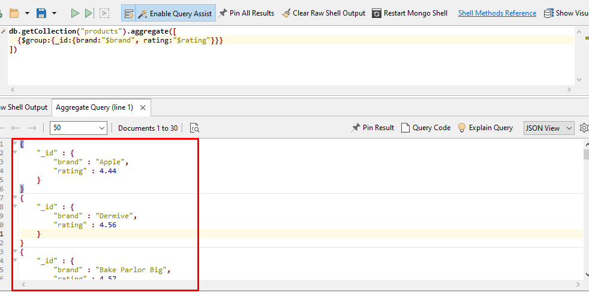

####  What is Mongoose Agreegate ? 
	Mongoose Agreegate   মানে ডাটাবাসে  এর ডাটা  Agreegate  এর বিভিন্ন পালাইনের মাধ্যমে ডকুমেন্ট গুলো প্রক্রিয়া করে  নতুন ডকুমেন্ট  ফিল্টার ,  গ্রুপ , ভ্যালু গনণা   করে  এবং সেই আউটপুট পরবর্তী  প্রদর্শিত হয় । 


### Fake Data Collect and Test Practiced  Agreegate 

[Fake Data Collected Link ](https://fakestoreapi.com/products)


### What is Aggreegation  Pipeline ? 
	একটি Aggreegation  পাইপলাইনে এক বা একাধিক ধাপ থাকে যা  Document গুলি প্রক্রিয়া করে: প্রতিটি পর্যায় ইনপুট Document তে একটি অপারেশন করে। উদাহরণস্বরূপ, একটি পর্যায় নথি ফিল্টার করতে পারে, Group Document , এবং Calculationg VAlues করতে পারে। একটি পর্যায় থেকে আউটপুট যে Document  পরবর্তী পর্যায়ে পাস করা হয়.
	 $match
	 $Group
	 $sort 
	$project 
	$count 
	$limit 
	$skip
	$out 

### Aggregation Pipeline Operators

##### Arithmetic Expression Operators
##### $add   -	 এটির মাধ্যমে আমরা একাধিক  ডাটার মান কে যোগ করতে পারি  । 
For Example : 


##### $abs   -	 এটির মাধ্যমে আমরা একাধিক  ডাটার মান কে যোগ করতে পারি  । 


## Match Stage Aggregation
Match  Stage  এর মাধ্যমে  ডাটাবেস এর কালেকশন এর ডাটাগুলোর সাথে ভালুর মিল থাকলে শুধু সেই ভালু বা ডাটা রিটার্ন করে । 
syntax : 
```javascript
{ $match: { <query> } }
```


## Group  Stage Aggregation
group stage  এর মাধ্যমে ডাটাবেস কালেকশন  থেকে প্রয়জনীয় ডাটা গুলো বিভিন্ন অপারেশনের মাধ্যমে রিটার্ন করে । 
অবশ্যই  _id  keyword  দিতে হবে । 

syntax : 
```javascript
{ $group: { <query> } }
```


### $group by nested fields 
কালেকশন এ ডাটা অব্জেক্ট আকারে থাকলে সেই  ভ্যালু গুলোর মান কে কুয়েরি করে গ্রুপ  করার সিস্টেম । 


### $group by multiple fields
কালেকশন এ ডাটা অব্জেক্ট গ্রুপ  আকারে একাধিক  ভ্যালু রিটার্ন করতে  এভাবে ব্যবহার করা  হয় । 



### $match and $group
কালেকশন এ ডাটা অব্জেক্ট ম্যাচিং এবং সেগুলোকে গ্রুপ আকারে ডাটা ফিল্টার করার প্রক্রিয়া । 

> এখানে প্রথমে গ্রুপ স্টেজ ব্যবহার করলে   তখন  নাল ভ্যালু দেখাবে ।  তাই শুরুতে ডাটা কে ম্যাচিং করার জন্য   match stage ব্যবহার করতে হবে । 


### swap $match and $Group

> যখন আমাদের ডাটা গ্রুপ করার পর সেখানে থেকে মাচিং এর  মাধ্যমে  ডাটা রিটার্ন করাতে চাই তখন প্রথমে গ্রুপ স্টেজ এবং পরে ম্যাচ স্টেজ ব্যবহার করা  হয় 


### Count Stage 
ডাটাবেস এর কালেকশন এ কতগুলো  ডাটা আছে তা  বের করার  জন্য  count stage   ব্যবহার করা হয় ।  "allDocumentsCount"   এর মাধ্যমে সকল ডাটার  গননা  এসে পরে । 


### $match , $group and $count
আমাদের কখন যদি  কোন  ভ্যালু দ্বারা ম্যাচ, গ্রুপ করার পর গননা করার  প্রয়োজন হয় তখন আমরা এভাবে ব্যবহার করতে  পারি  । 


### $sort stage aggregation 
সমস্ত ডকুমেন্ট  কে  বাছাই বা ফিল্টার এর মাধ্যমে তথ্য দেওয়ার প্রক্রিয়া করে থাকে । এখানে -১ এসেন্ডিং এবং ১ ডিসেন্ডিং হিসেবে কাজ করে 


### Project Stage Aggregation
project stage  এর  মাধ্যমে ডকুমেন্ট এর  মাধ্যমে ডাটা নির্দিষ্ট ভাবে  দেখানো হয় । এছাড়া  ০, ১ এর  মাধ্যমে কোন কোন ডাটা  দেখানো হবে তা উল্লেখ করে দেওয়া  যায় ।  এবং অব্জেক্ট হিসেবে মডিফাই এর  মাধ্যমে  ডাটা রিটার্ন করা  যায় । 


### Unwind  Stage Aggregation
নির্দিষ্ট ডাটাতে তার অব্জেক্ট এর মাধ্যমে  উন্মুক্ত করার জন্য  unwind stage   ব্যবহার করা হয় । 


### Sum and Group   Stage Aggregation


